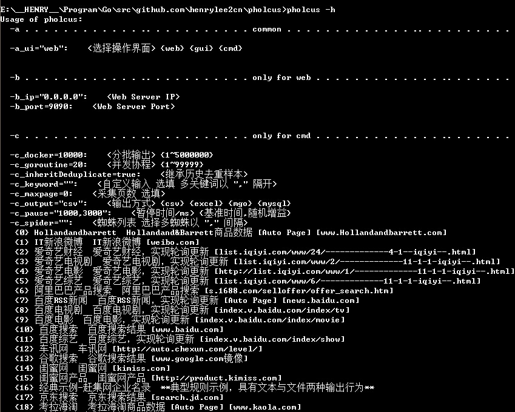
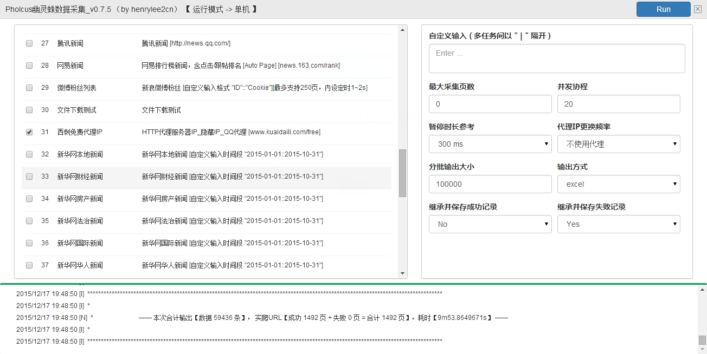

### 1.2 编译运行

#### 1.2.1 创建项目

```
package main

import (
    "github.com/henrylee2cn/pholcus/exec"
    // "github.com/henrylee2cn/pholcus/logs"

    _ "github.com/pholcus/spider_lib" // 此为公开维护的spider规则库
    // _ "spider_lib_pte" // 同样你也可以自由添加自己的规则库
)

func main() {
    // 允许日志打印行号
    // logs.ShowLineNum()

    // 设置运行时默认操作界面，并开始运行
    // 运行软件前，可设置 -a_ui 参数为"web"、"gui"或"cmd"，指定本次运行的操作界面
    // 其中"gui"仅支持Windows系统
    exec.DefaultRun("web")
}
```

&nbsp;

#### 1.2.2 编译运行

正常编译方法
```
go install 或者 go build
```
Windows下隐藏cmd窗口的编译方法
```
go install -ldflags="-H windowsgui" 或者 go build -ldflags="-H windowsgui"
```
查看可选参数: 
```
pholcus -h
```

&nbsp;

> *<font size="2">(注意：当运行web操作界面时请将 src/github.com/henrylee2cn/pholcus/web 文件夹拷贝至当前项目目录下，其中的go文件可删除)，Web版操作界面截图如下：*

&nbsp;

> *<font size="2">GUI版操作界面之模式选择界面截图如下*

&nbsp;

> *<font size="2">Cmd版运行参数设置示例如下*

```
pholcus -a_ui=cmd -c_spider=3,8 -c_output=csv -c_thread=20 -c_docker=5000 -c_pause=300 
-c_proxy=0 -c_keyword=pholcus,golang -c_maxpage=10 -c_inherit_y=true -c_inherit_n=true
```

&nbsp;
