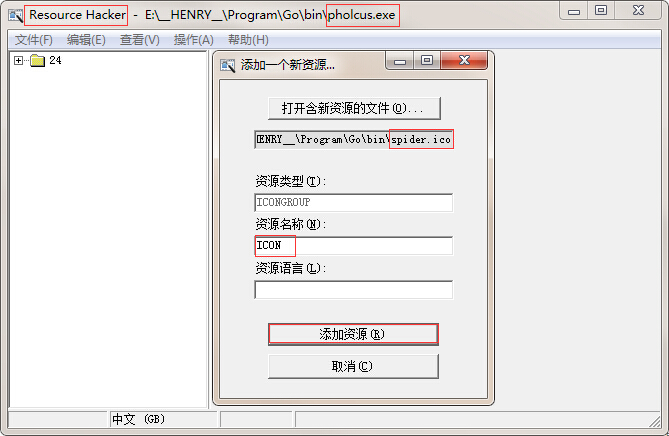

### 1.2 编译运行

#### 1.2.1 创建项目

```
package main

import (
	"github.com/henrylee2cn/pholcus/config"
	// 按界面需求选择相应版本
	// "github.com/henrylee2cn/pholcus/web" // web版
	"github.com/henrylee2cn/pholcus/cmd" // cmd版
	// "github.com/henrylee2cn/pholcus/gui" // gui版
)

// 导入自己的规则库（须保证最后声明，即最先导入）
import (
	_ "github.com/pholcus/spider_lib" // 此为公开维护的spider规则库
	// _ "path/myrule_lib" // 同样你也可以自由添加自己的规则库
)

// 自定义相关配置，将覆盖默认值
func setConf() {
	//mongodb服务器地址
	config.MGO_OUTPUT.Host = "127.0.0.1:27017"
	// mongodb输出时的内容分类
	// key:蜘蛛规则清单
	// value:数据库名
	config.MGO_OUTPUT.DBClass = map[string]string{
		"百度RSS新闻": "1_1",
	}
	// mongodb输出时非默认数据库时以当前时间为集合名
	// h: 精确到小时 (格式 2015-08-28-09)
	// d: 精确到天 (格式 2015-08-28)
	config.MGO_OUTPUT.TableFmt = "d"

	//mysql服务器地址
	config.MYSQL_OUTPUT.Host = "127.0.0.1:3306"
	//msyql数据库
	config.MYSQL_OUTPUT.DefaultDB = "pholcus"
	//mysql用户
	config.MYSQL_OUTPUT.User = "root"
	//mysql密码
	config.MYSQL_OUTPUT.Password = ""
}

func main() {
	setConf() // 不调用则为默认值

	// 开始运行
	// web.Run() // web版
	cmd.Run() // cmd版
	// gui.Run() // gui版
}

```

&nbsp;

#### 1.2.2 Web版编译运行

```
go install (可选参数： -ip 0.0.0.0 -port 9090)
```
或者
```
go build (可选参数： -ip 0.0.0.0 -port 9090)
```
> *<font size="2">(注意：将 src/github.com/henrylee2cn/pholcus/web 文件夹拷贝至当前项目目录下，其中的go文件可删除)*


&nbsp;

#### 1.2.3 GUI版编译运行
1. 编译
```
go install -ldflags="-H windowsgui"
```
或者
```
go build -ldflags="-H windowsgui"
```

2. 添加ICON



> *<font size="2">(下图为GUI选择模式界面图例)*


&nbsp;

#### 1.2.4 Cmd版编译运行
```
编译命令: go install pholcus-cmd.go  或者  go build pholcus-cmd.go
查看命令参数: pholcus-cmd.exe -h
执行爬虫命令: pholcus-cmd.exe -spider=1,3 -output=csv -go=500 -docker=5000 -pase=1000,3000 -kw=pholcus,golang -page=100
```

> *<font size="2">(注：花括号“{}”中为选择参数或参数格式，多个参数值之间用逗号“,”间隔，各项参数根据采集规则的需要自行设置)*
